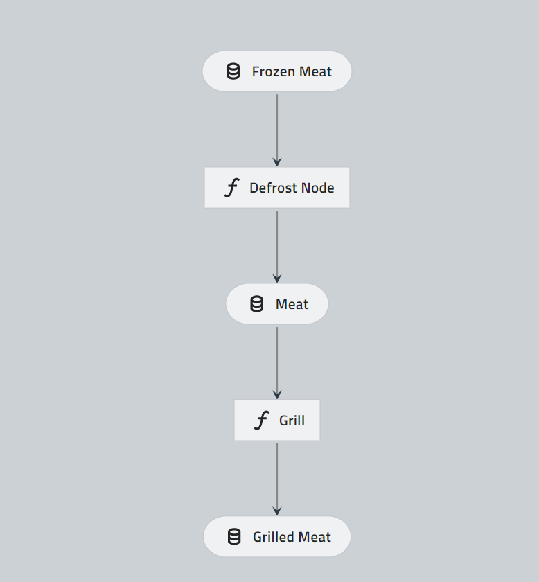
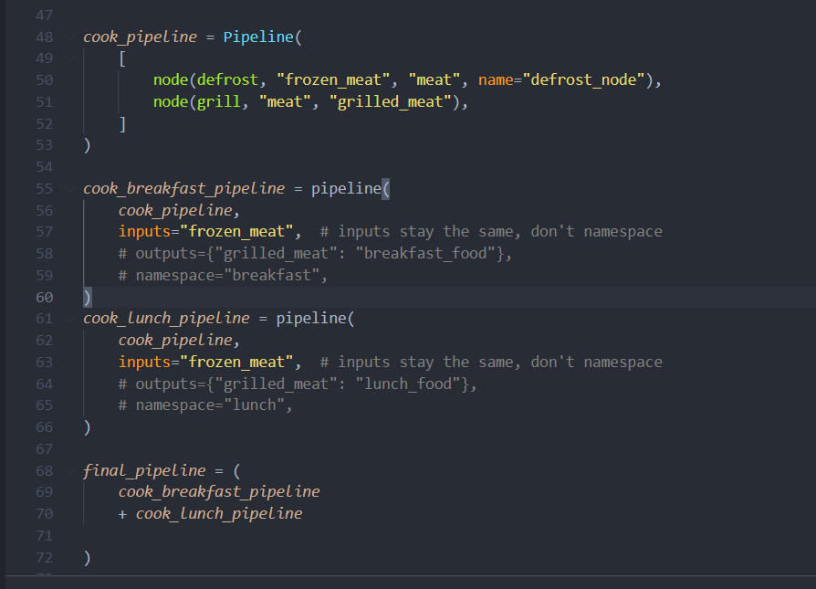
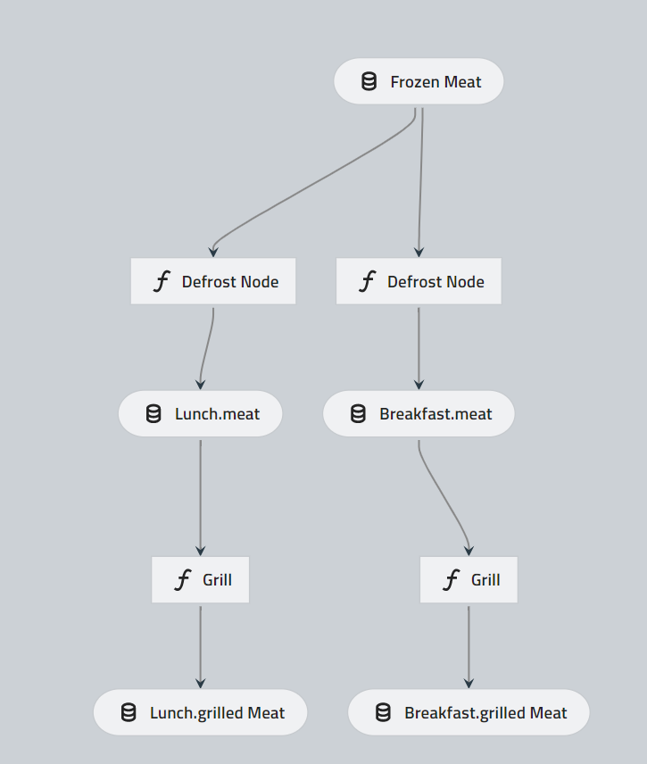
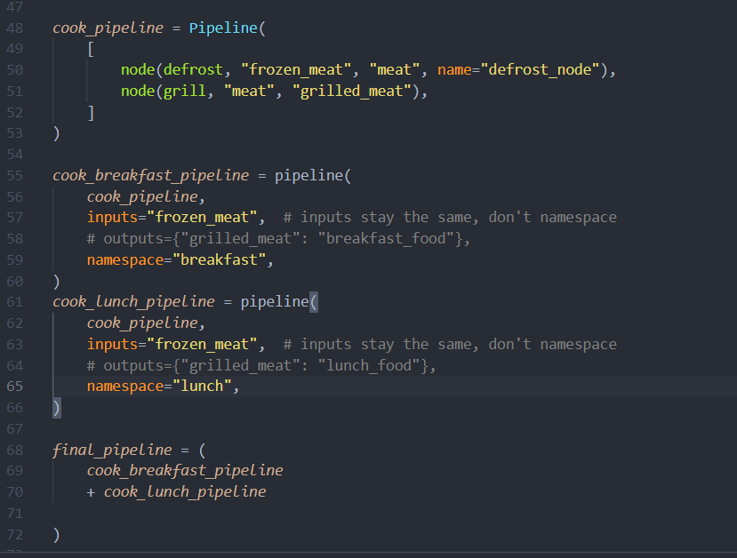
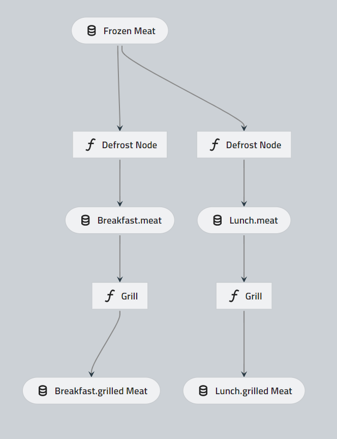
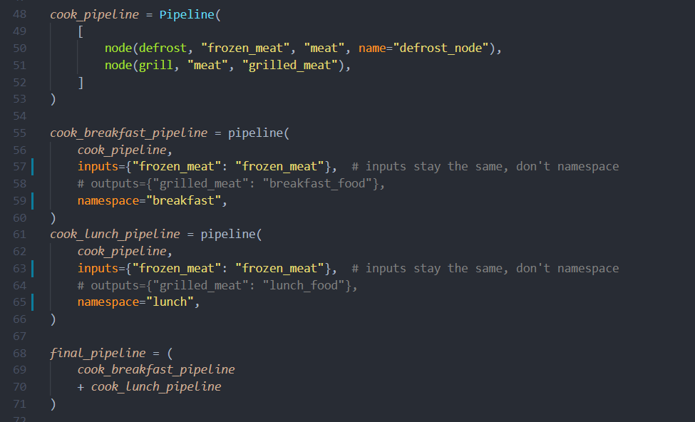
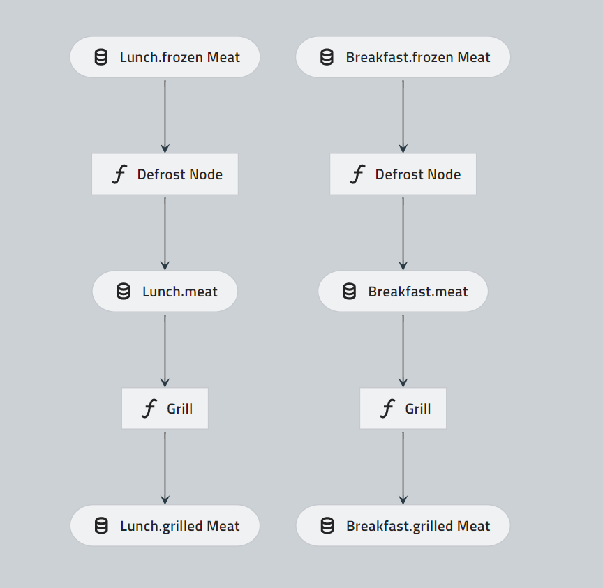
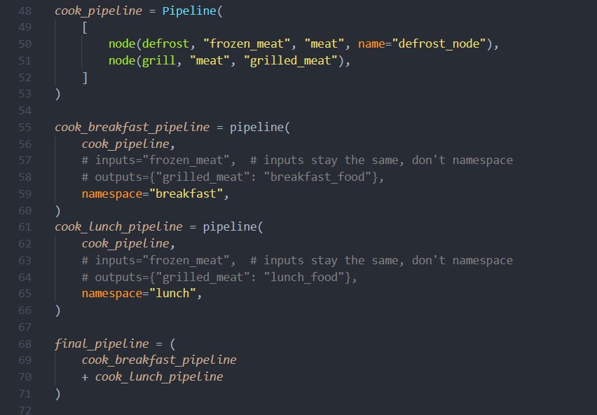

# modular_pipeline

Try different things:
* How does namespace work?
* What are the impact freezing input or remap dictionary?

|     |     |
| --- | --- |
| Node | Script |
|  |  |
|  |  |
|  |  |
|  |  |

M_ACT_OOCL_INV_CHG
M_ACT_OOCL_EQP_HIST